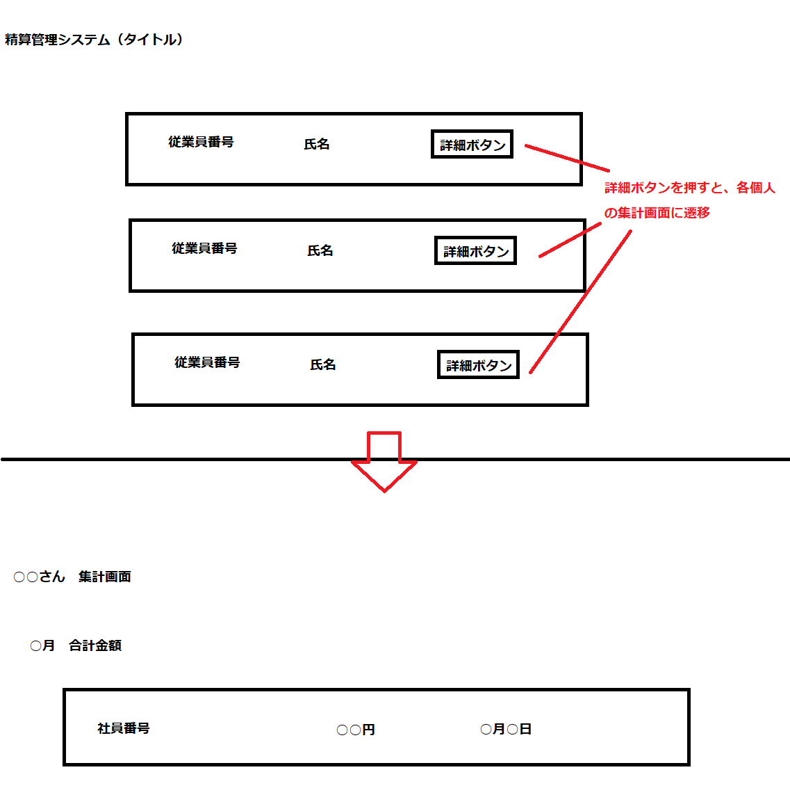
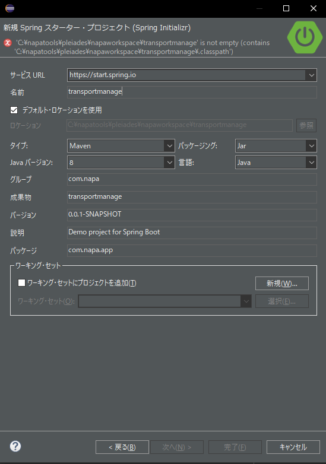
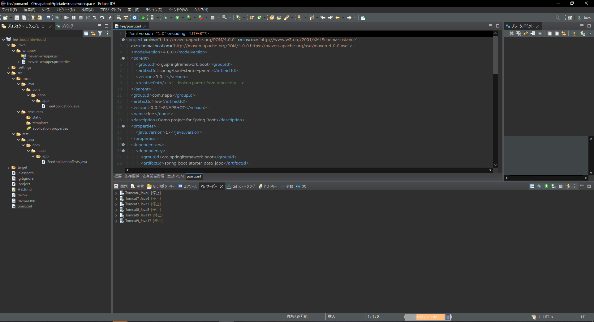
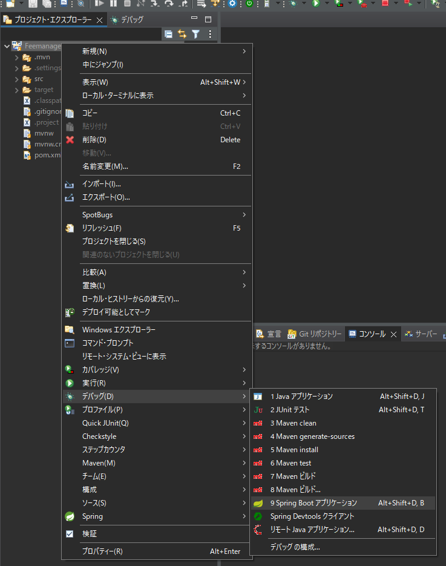
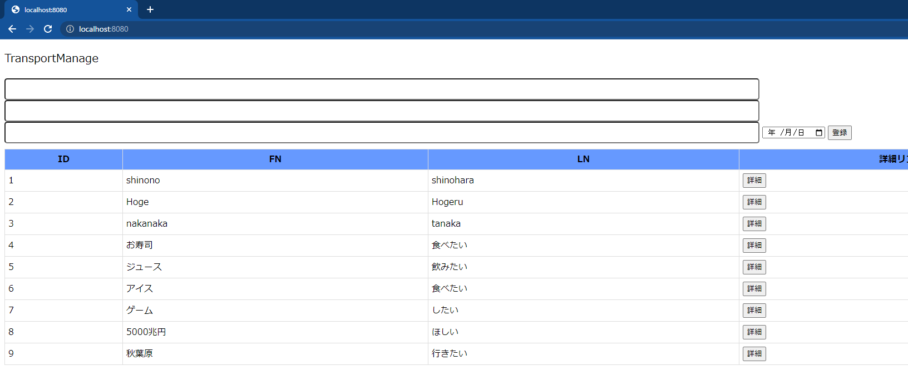
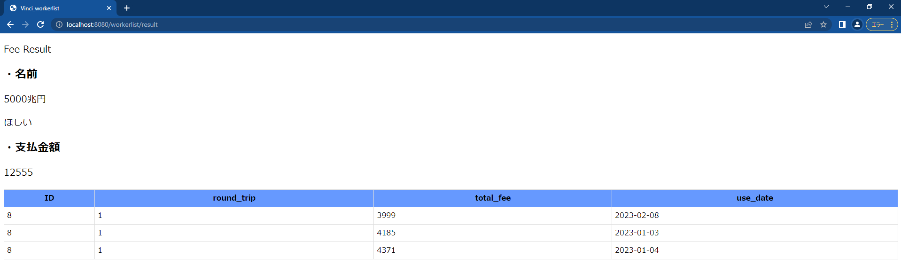
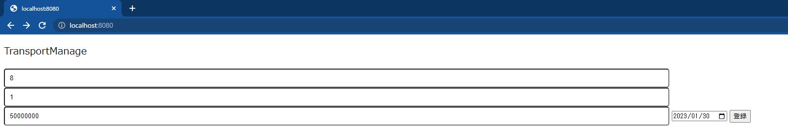
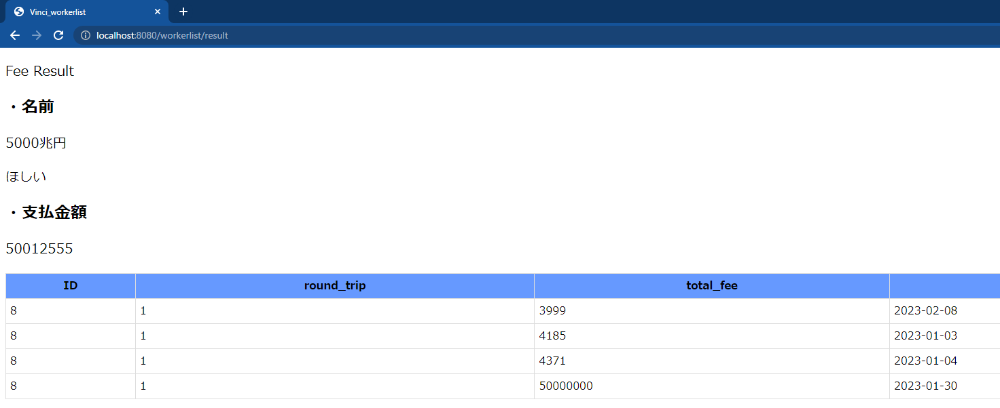
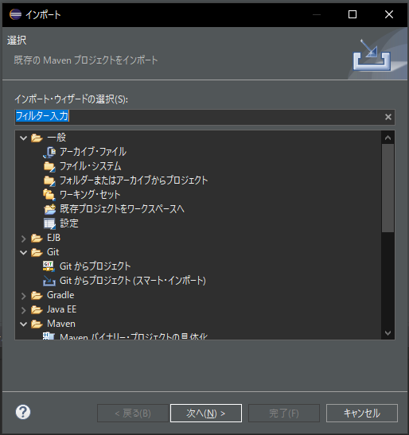
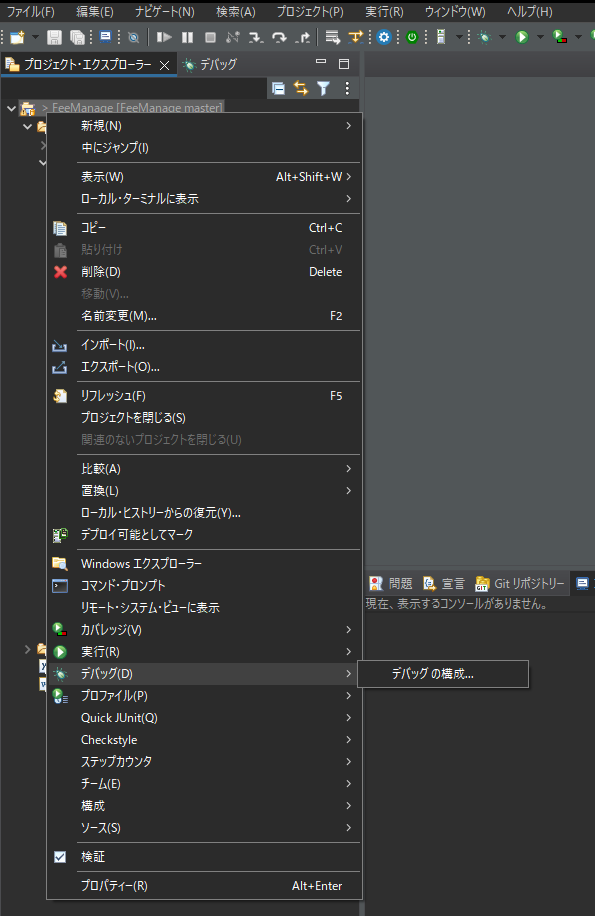

## 事務管理をSpringに任せてみよう！

はじめまして！音ゲー大好き、入社一年目の篠原です。</br>
今回のテーマは”脱Excel”です</br>

突然ですが、皆さんExcel、使われていますか？</br>
私は何でもできてしまうExcelが大好きです。前職ではExcelの達人として引っ張りだこでした。</br>
そんなExcelですが、何でもできてしまうため、清算管理としてExcelを使用する職場も多いのではないでしょうか？</br>
しかし、個人個人の清算管理（給与額とか）となると人数分Excelファイルができるため、集計する人側からすると大変だったりします。</br>
そこで、今回はspring bootを使って、集計作業が楽な、清算管理システムを作ってみよう！と思い立ったわけです。</br>

※前提

- 使用PC : Windows10

---
## 目次

1. [なぜ、Spring boot??](#title1)
2. [今回やりたいこと](#title2)
 3. [Spring　Boot　開始！！](#title2-1)
3. [DBを作成する](#title3)
 4. [Apple Developer Programに登録](#title3-1)
 5. [Xcodeでプロジェクトの作成](#title3-2)
 6. [Cocoapodのインストール](#title3-3)
 7. [Firebase SDKのインストール](#title3-4)
 8. [Firebaseプロジェクトの登録とアプリの登録を行う](#title3-5)
 9. [GoogleService-Info.plistをアプリのプロジェクトに追加する](#title3-6)
 10. [Apple Developer ProgramでAPNs認証キーを作成する](#title3-7)


---
<h2 id="title1">1. なぜ、Spring boot??</h2>
Spring　Bootを選んだ理由としましては、調べてて 「難しい設定不要で、すぐに始められそう！」と思ったからです。</br>
今まで「なにか作ってみよう！」と思ったことがありますが、大抵がプロジェクトの立ち上げの環境構築などで挫折していました。（もっと頑張れ、自分）<br>


<h2 id="title2">2. 今回やりたいこと</h2>
冒頭でも申し上げましたが、今回は個人のデータ数十件を、事務担当者が集計する際に手間のかからない様なシステムを構築することが目的です。<br>
ざっと、目指したいものを図示します。コーディングしてて思いましたが、この作業めちゃ大事だなって思いました。
</br>

ざっと説明すると、アプリを起動すると、社員全ての情報（従業員番号、氏名等）が一覧となっているページが表示され、それぞれの従業員情報の横に、詳細ボタンが有り、クリックすると対応するユーザーの集計画面に遷移する、といった流れです。<br>
今回は、「交通費の管理」を例にして作りますので、電車の使用履歴を集計します。

<h2 id="title2">2. Spring　Boot　開始！！</h2>

プロジェクトを作成します。<br>
今回使用使用している環境は次のとおりです。

- windows10
- Eclipse IDE for Java Developers Version: 2022-09 (4.25.0)
- mysql version 8.0.30

eclipseを起動し、spring bootプロジェクトを開始します。（Spring Initializr)<br>
画面に従い、構成を設定していきます。<br>


次に依存関係の設定を行います。初め、依存関係って何？？と困惑しましたが、ざっくりいうと、どんな機能を使いたいか！のようです。<br>


上記を終えて、完了ボタンを押すと、プロジェクトの雛形が作成されます！こんなに簡単に、、、、というので本当に驚きました。。。嘘みたいに爆速でしたが、これで準備は完了です。<br>



<h2 id="title3">3. DBを作成する</h2>
先程のInitializrでプロジェクト開始の準備は整いましたが、「どのDBと連携するか？」といったことは設定できていませんので行います。<br>
\src\main\resources\application.propertiesにDBの情報を書き込んでいきます。<br>
今回の場合は以下の通り記載しました。<br>

```
spring.datasource.driver-class-name=com.mysql.cj.jdbc.Driver
spring.datasource.url=jdbc:mysql://localhost:3306/transportmanage
spring.datasource.username=root
spring.datasource.password=root
```
２行目の"transportmanage"が今回作成したDBで、簡単な設計は以下のとおりです。

#### workerテーブル（社員情報）
- id
- first_name
- last_name
  
#### feeテーブル
- id
- round_trip
- totale_fee
- use_date

双方のテーブルをid紐づけて参照できるようにしています。<br>
これでDBの準備も完了です。

<h2 id="title4">4.コーディングしよう</h2>
それではコーディングをしていきます。<br>
今回、spring bootを使って！ということは冒頭でもお話しましたが、Mybatis　というフレームワークも鍵となってきます。<br>
MybatisはJavaとRDBのやり取りを簡略化してくれるデータマッパーフレームワークです。<br>
アノテーションやxmlを使用することにより、オブジェクトとSQLを簡単に結びつけてくれます。

<h3 id="title4-1">4-1.　entityの作成</h3>
先程作成したテーブルのentityを作成します。<br>


```
package com.napa.app.entity;

import lombok.Data;

@Data
public class Fee {
//	feeテーブルより取得
    private Integer id;
    private Integer round_trip;
    private int total_fee;
    private String use_date; 
}
```

```
package com.napa.app.entity;

import lombok.Data;

@Data
public class Worker {
//	workerテーブルより取得
    private Integer id;
    private String first_name;
    private String last_name;
}

```

@Data は　lombokの機能で、このアノテーションを使用するとsetter,getterの記述無しで処理を行ってくれます。簡単にしたかったので、もちろん利用です。<br>

<h3 id="title4-2">4-2.　Formの作成</h3>
今回のアプリの要となる検索用のidはこちらのFormに格納されます。<br>
後述しますが、html(tymeleaf)からidはpostされます。


```
package com.napa.app.form;
import lombok.Data;

@Data
public class FeeForm {
	private Integer id;
}

```

<h3 id="title4-3">4-3.　Daoの作成</h3>

続いてDaoを作成します。<br>
ここで、先程紹介したMybatisが底しれぬ力を見せつけてくれます。


```
package com.napa.app.dao;
import java.util.List;

import org.apache.ibatis.annotations.Mapper;

import com.napa.app.entity.Worker;
@Mapper
public interface WorkerDao {
	

	List<Worker> AllWorker();

}

```

```
package com.napa.app.dao;
import java.util.List;

import org.apache.ibatis.annotations.Mapper;

import com.napa.app.entity.Fee;
@Mapper
public interface FeeDao {
	
	List<Fee> feeResult(Fee fee);
	
	List<Fee> AllFeeResult();
	
	void add(Fee fee);

}
```


@MapperはMybatisのアノテーションでインターフェースに付与します。これを付すことによってxmlにsqlを記載するだけでDBとのやり取りができてしまいます。<br>
どういうことかというと

- resources\com\napa\app\dao\WorkerDao.xml

```
<?xml version="1.0" encoding="UTF-8"?>
<!DOCTYPE mapper
        PUBLIC "-//mybatis.org//DTD Mapper 3.0//EN"
        "http://mybatis.org/dtd/mybatis-3-mapper.dtd">
<mapper namespace="com.napa.app.dao.WorkerDao">

    <select id="AllWorker" resultType="com.napa.app.entity.Worker">
        SELECT * From worker order by id
    </select>
    
</mapper>
```

- resources\com\napa\app\dao\FeeDao.xml

```
<?xml version="1.0" encoding="UTF-8"?>
<!DOCTYPE mapper
        PUBLIC "-//mybatis.org//DTD Mapper 3.0//EN"
        "http://mybatis.org/dtd/mybatis-3-mapper.dtd">
<mapper namespace="com.napa.app.dao.FeeDao">
	<select id="feeResult" resultType="com.napa.app.entity.Fee">
		SELECT * From fee WHERE id = #{id}
	</select>

	<select id="AllWorker" resultType="com.napa.app.entity.Fee">
		SELECT * From fee WHERE id = #{id}　order by id
	</select>

	<insert id="add" parameterType="com.napa.app.entity.Fee">
		insert into fee (id,round_trip,total_fee,use_date)
		values (#{id},#{round_trip},#{total_fee},#{use_date})
	</insert>

</mapper>

```

selectやinsertで囲まれている部分を見てみると、本当に中にSQL文がそのまま記載されています。
こういった形で、使用するentityとsqlを記載するだけでOKなのです。<br>
こういったアプリを作る際の私の印象としては、「いっぱいいろいろ書かないと行けなくて面倒そう、、、」というので全然手を動かしませんでしたが、気づいたらマッピングが終わっていました。びっくりです。<br>
注意点として、xmlのディレクトリには注意してください。@mapperを使用する際は、daoと対応した形で配置する必要があります。

```
 java\com\napa\app\dao\FeeDao.java

 resources\com\napa\app\dao\FeeDao.xml
 ```

 ```
java\com\napa\app\dao\WorkerDao.java

resources\com\napa\app\dao\WorkerDao.xml
```

どちらもjava配下か、resources配下が違うのみで、その下は対応した形となっています。<br>
私はこれが守れてなくて、何故動かないのか、３時間ほど悩んでました。（ぴえん）
上記の通り対応する場所に配置するとあっさり動いちゃいました。<br>
こんな基本的なこと間違えないよ！と私も思って注視していませんでしたが、意外と意外と見落としがちなので、「動かない」と思ったときは、すぐに確認できるのでこちらを見てみてください。


<h3 id="title4-5">4-5.　Viewの作成</h3>
イメージが湧きやすくなると思うので、先にviewの部分を記載します。<br>
index.htmlが最初の授業員一覧の部分で、社員一覧が表示されています。<br>
ここから従業員番号を選択すると、従業員の電車使用履歴情報（main.html)に遷移するようにしています。<br>
どうしてもテーブルを使用してきれいに表示したかったので、inputをhiddenで隠して見えてないけどpostできるようにしてます。<br>

```
					<form action="/workerlist/result" method="post">
						<input type="hidden" name="id" th:value="*{id}"> <input
							type="hidden" name="first_name" th:value="*{first_name}"> <input
							type="hidden" name="last_name" th:value="*{last_name}"> <input
							type="submit" value="詳細">
					</form>
```


なお、今回はviewでThymeleafを使用していますが、当社の社員がTechBlogで記載していますので、詳細はそちらをご覧いただければと思います。<br>

https://www.i-vinci.co.jp/techblog/664

 - index.html

```
<!DOCTYPE HTML>
<html xmlns:th="http://www.thymeleaf.org">
  <head>
    <title th:text="${title}">title</title>
    <link href="/css/style.css" rel="stylesheet">
    <meta http-equiv="Content-Type" content="text/html; charset=UTF-8" />
  </head>
  <body>
  
  <p> Fee Result<p>
  
     <h2>・名前</h2>

    <p th:text = "${first}"> <p>
    <p th:text = "${last}"> <p>
    
     <h2>・支払金額</h2>
    <p th:text = "${sumfee}"> <p>


    <div th:if="${fee} !=null" th:object="${fee}">
        <table>
            <tr>
                <th>ID</th>
                <th>round_trip</th>
                <th>total_fee</th>
                <th>use_date</th>
            </tr>
            
            <tr th:each="result:${fee}" th:object="${result}">
                <td th:text="*{id}">id</td>
                <td th:text="*{round_trip}">往復</td>
                <td th:text="*{total_fee}">合計金額</td>
                <td th:text="*{use_date}">使用日</td>
            </tr>

        </table>
    </div>

  </body>
</html>
```

 - main.html

```
<!DOCTYPE HTML>
<html xmlns:th="http://www.thymeleaf.org">
<head>
<title th:text="${title}">title</title>
<link href="/css/style.css" rel="stylesheet">
<meta http-equiv="Content-Type" content="text/html; charset=UTF-8" />
</head>
<body>
	<p>TransportManage</p>

	<div>

		<form action="/workerlist/add" method="post">
			<input type="text" name="id"> <input type="text"
				name="round_trip"> <input type="text" name="total_fee">
			<input type="date" name="use_date"> <input type="submit"
				value="登録">

		</form>
	</div>
	<div th:if="${Worker} !=null" th:object="${Worker}">

		<table>
			<tr>
				<th>ID</th>
				<th>FN</th>
				<th>LN</th>
				<th>詳細リンク</th>
			</tr>
			<tr th:each="result:${Worker}" th:object="${result}">
				<td th:text="*{id}">id</td>
				<td th:text="*{first_name}">往復</td>
				<td th:text="*{last_name}">合計金額</td>
				<td>
					<form action="/workerlist/result" method="post">
						<input type="hidden" name="id" th:value="*{id}"> <input
							type="hidden" name="first_name" th:value="*{first_name}"> <input
							type="hidden" name="last_name" th:value="*{last_name}"> <input
							type="submit" value="詳細">
					</form>
				</td>
			</tr>
		</table>
	</div>
</body>
</html>

```


<h3 id="title4-5">4-5.　Controllerの作成</h3>

ゴールが見えてきました。
最後はcontrollerの作成です。
controllerはViewとModelの制御をしてくれる部分です。<br>
Spring Bootでは、クラスに@controllerを付与するだけでcontrollerとして認識してくれます。
また、@RequestMapping("/workerlist")という記載は、()内に記載されているパスへ遷移した際に、本アノテーションを付与したクラスの処理がされます。


```
package com.napa.app.controller;

import java.util.List;

import org.springframework.beans.factory.annotation.Autowired;
import org.springframework.stereotype.Controller;
import org.springframework.ui.Model;
import org.springframework.web.bind.annotation.RequestMapping;

import com.napa.app.entity.Worker;
import com.napa.app.service.WorkerService;

@Controller
public class WorkerController {

	@Autowired
	WorkerService workerservice;

	@RequestMapping("/")
	public String main(Model model) {

		List<Worker> list = workerservice.AllWorkerSelect();
		model.addAttribute("Worker", list);
		return "main";

	}
}

```
```
package com.napa.app.controller;

import java.util.List;

import org.springframework.beans.factory.annotation.Autowired;
import org.springframework.stereotype.Controller;
import org.springframework.ui.Model;
import org.springframework.web.bind.annotation.RequestMapping;
import org.springframework.web.bind.annotation.RequestParam;

import com.napa.app.entity.Fee;
import com.napa.app.form.FeeForm;
import com.napa.app.service.FeeService;

@Controller
@RequestMapping("/workerlist")
public class FeeController {

	Integer sum = 0;

	@Autowired
	FeeService feeservice;

	@RequestMapping("/result")
	public String index(
			@RequestParam String first_name,
			@RequestParam String last_name,
			FeeForm feeform,
			String showList,
			Model model) {
		sum = 0;
		model.addAttribute("title", "Vinci_workerlist");
		model.addAttribute("first", first_name);
		model.addAttribute("last", last_name);

		if (feeform.getId() != null) {
			List<Fee> list = feeservice.feeResult(feeform.getId());
			for (int i = 0; i < list.size(); i++) {
				sum += list.get(i).getTotal_fee();
			}

			model.addAttribute("fee", list);
			model.addAttribute("sumfee", sum);

		}

		return "index";

	}
	
	@RequestMapping("/add")
	public String add(Fee fee) {
		feeservice.FeeAdd(fee.getId(), fee.getRound_trip(), fee.getTotal_fee(),fee.getUse_date());
		return "redirect:/";
	}
}

```


少し駆け足で進めましたが、ここで作成したアプリを起動してみます。
プロジェクトを右クリック→デバッグ→SpringBootアプリケーション　を押していくとできます。
（もちろん、開始の方からでも大丈夫です）


ものすごく文句を言われてしまいました。


これは毎度のことなのですが、mysqlが起動できてません。
mysqldで起動します。


無事起動しました！現在コンテキストパスにアクセスしているので、index.htmlが表示されています。
それでは、「5000兆円欲しい」さんの詳細ボタンを押下してみます。



使用した履歴に加え、上部に合計金額を出力できています。
合計金額の出力については、しれっとWorkerControllerにて処理を記載していました。

```
		if (feeform.getId() != null) {
			List<Fee> list = feeservice.feeResult(feeform.getId());
			for (int i = 0; i < list.size(); i++) {
				sum += list.get(i).getTotal_fee();
			}

			model.addAttribute("fee", list);
			model.addAttribute("sumfee", sum);

		}
```

今回insert機能も追加しています。
ID8の5000兆円欲しいさんについて入力してみましょう。
（何も説明ないですが、上からID、往復、金額、日付の順で入力します）
※金額がIntegerですので、5000兆円は手に入りません！！


登録ボタンを押して、もう一度詳細を見てみます。

無事追加されていることが確認できます。
簡単にですが、アプリ完成です！！


はまったこと






<h2 id="title6">6. まとめ</h2>
